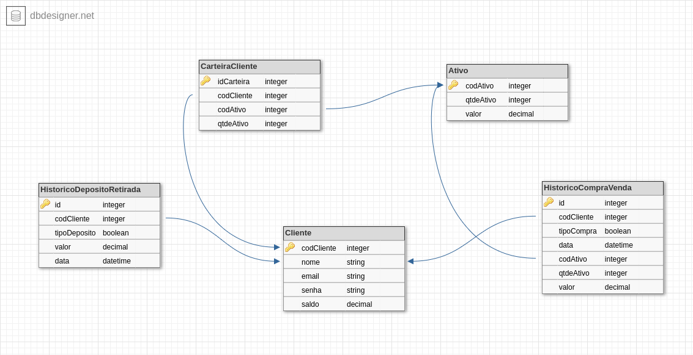

# Desafio do Processo Seletivo da XP

Esta é uma API RESTful de simulação de operações bancárias com autenticação JWT.

## Sumário

- [Visão geral](#visão-geral)
  - [O desafio](#o-desafio)
  - [Imagens](#Imagem-do-banco-de-dados)
  - [Deploy](#Link-da-Documentação-da-API)
- [Meu processo](#meu-processo)
  - [Construído com](#construído-com)
  - [Recursos úteis](#recursos-úteis)
- [Executando localmente](#executando-localmente)
  - [Com Docker](#com-docker)
  - [Sem Docker](#sem-docker)
  - [Testes](#testes)
- [Autora](#autora)

## Visão geral

### O desafio

O desafio foi a construção de uma API com operações de CRUD e autenticação do Cliente.

**Os clientes devem ser capaz de?**

- Registrar-se e Autenticar-se
- Fazer Depósitos e Retiradas da conta Bancária.
- Fazer Compra e Venda de Ativos.
- Buscar Ativos da Corretora.
- Buscar Ativos da Carteira de Investimentos da Conta.
- Buscar o saldo da Conta Bancária.
- Verificar o Extrato Bancário por período desejado.
- Verificar o Relatório de Investimentos por período desejado.

### Imagem do Banco de Dados

<small>Banco de Dados</small>


### Link da Documentação da API

- URL da aplicação: https://invest-xp.herokuapp.com/api-docs/

## Meu processo

### Construído com

- TypeScript
- Node.js
- Express.js
- JWT : Para autenticação do cliente
- Bcrypt : Para a criptografia da senha cadastrada
- Joi : Para a validação dos campos nas entradas de dados
- express-async-errors : Para a captura de erros em um único middleware de erros
- Prisma : ORM para mapeamento de bancos relacionais
- MySQL : Gerenciador de banco de dados
- Mocha, Chai and Supertest : Para a realização de testes E2E

### Recursos úteis

- [Prisma Documentação](https://www.prisma.io/)

## Executando localmente

### Com Docker

Clona o repositório

```bash
git clone git@github.com:lorenepecci/DesafioXP.git
```

Entra no repositório

```bash
cd DesafioXP
```

Instala as dependências

```bash
npm install
```

Sobe os containers

```bash
docker-compose up -d
```

Agora a aplicação já está rodando em desenvolvimento, só entrar em:  http://localhost:3001/api-docs/


### Sem Docker

**É necessário ter o Node.js e o MySQL instalado localmente!**

Clona o repositório

```bash
git clone git@github.com:lorenepecci/DesafioXP.git
```

Entra no repositório

```bash
cd DesafioXP
```

Instala as dependências

```bash
npm install
```

Crie um arquivo .env e configure as variáveis de ambiente (Veja o arquivo: '.env.example') 


Executa o projeto manualmente

```bash
npm run dev
```

## Testes

Para rodar os testes

```bash
npm run test
```

## Autora

- LinkedIn - [Lorene Pecci](https://www.linkedin.com/in/lorene-pecci/)
